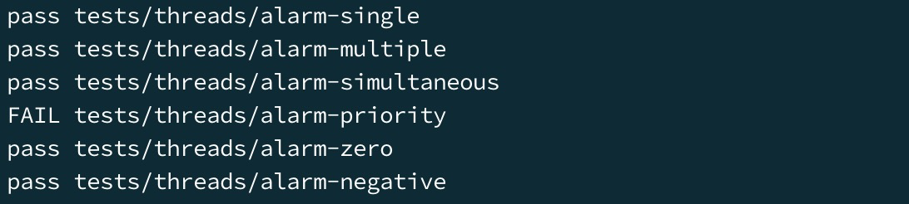

## Project 1

### Overview

Before starting, I got a preliminary understanding of the contents of several directories under Pintos:

```
threads/: Kernel source code
userprog/: User program loading code
vm/: Virtual memory directory
filesys/: File system directory
devices/: I/O device driver directory
lib/: Contains some standard C language functions
lib/kernel/: Some C language functions specific to Pintos
lib/user/: Contains some header files and other C language functions specific to Pintos
tests/: Test cases for each project
examples/: Some examples for Project 2
misc/ & utils/: Two folders not recommended for modification by the official documentation
```

Browsing the official Pintos documentation revealed that

 the `threads/` directory contains files with the following functionalities:

//todo

In addition, by reviewing the appendix of the official documentation on Debugging Tools, I learned about the usage of two commonly used debugging tools. The first one is `ASSERT`, described by the official documentation as follows:


The purpose of `ASSERT` is to test the expression within the parentheses. If the expression is false, a kernel panic occurs, and detailed error information is printed on the screen.

The second debugging tool is `printf()`, used similarly to standard C library functions.

### Mission 1: Alarm Clock (Busy Waiting Issue)

#### Requirement

In this task, I needed to reimplement `timer_sleep()` in the `devices/timer/c` directory. Although the current code provides an implementation, it uses busy waiting. That is, it checks whether the current time has passed `ticks` clock ticks in a loop and repeatedly calls `thread_yield()` until the loop ends. **The task is to reimplement this function to avoid busy waiting.**

Functions like `timer_msleep()`, `timer_usleep()`, `timer_nsleep()`, etc., will automatically call `timer_sleep()` periodically and therefore do not need modification.

#### Analysis

In the existing implementation of `timer_sleep()`, the code is as follows:

```c
/* Sleeps for approximately TICKS timer ticks.  Interrupts must
   be turned on. */
void
timer_sleep (int64_t ticks) 
{
  int64_t start = timer_ticks ();

  ASSERT (intr_get_level () == INTR_ON);
  while (timer_elapsed (start) < ticks) 
    thread_yield ();
}
```

1. First, `start` records the current time upon entering this function.
2. Then, it checks if interrupts are enabled using `intr_get_level()`. If not, it causes a kernel panic.
3. It uses `timer_elapsed()` to check the difference between the current elapsed time and `start`.
4. It checks if the elapsed time is less than the given `ticks`. If not, it calls `thread_yield()` to put the thread to sleep.

Next, I looked at the `thread_yield()` function. This function is located in `threads/threads.c`:

```c
/* Yields the CPU.  The current thread is not put to sleep and
   may be scheduled again immediately at the scheduler's whim. */
void
thread_yield (void) 
{
  struct thread *cur = thread_current ();
  enum intr_level old_level;
  
  ASSERT (!intr_context ());

  old_level = intr_disable ();
  if (cur != idle_thread) 
    list_push_back (&ready_list, &cur->elem);
  cur->status = THREAD_READY;
  schedule ();
  intr_set_level (old_level);
}
```

1. It first gets the currently running thread using `thread_current()`. This pointer to the thread structure contains the following fields:
   [Thread Structure Fields]
2. It gets the `old_level`, which is the interrupt status at the time of calling the function. It temporarily disables interrupts in `intr_disable()`.
3. It checks if the current thread is not the idle thread. If it's not, it pushes the current thread to the end of the `ready_list`.
4. It schedules the current thread and sets the interrupt level back to the level when `thread_yield()` was called.

Reviewing `timer_sleep()`, I found that it spins in a loop, repeatedly putting the thread to sleep by yielding until a certain amount of time has passed. This results in busy waiting to make the thread sleep for a specific time. To remedy this, the function repeatedly moves the thread from the running state to the end of the ready list during this time. When scheduling occurs, if the time is not up, the thread is placed at the end again, which is inefficient.

Observing the `thread_block()` and `thread_unblock()` functions, I found their comments:

```c
/* Puts the current thread to sleep.  It will not be scheduled
   again until awoken by thread_unblock().

   This function must be called with interrupts turned off.  It
   is usually a better idea to use one of the synchronization
   primitives in synch.h. */
void
thread_block (void) 
{
  ASSERT (!intr_context ());
  ASSERT (intr_get_level () == INTR_OFF);

  thread_current ()->status = THREAD_BLOCKED;
  schedule ();
}
```

It can be seen that if a thread is set to a blocked state, it will not be scheduled again until `thread_unblock()` is called. This is what we need.

#### Solution

To solve this problem, when a thread calls `timer_sleep()` for the first time, I set the thread's status to blocked by calling `thread_block()` and record the time to block. This way, `timer_sleep()` completes its job of putting the thread to sleep and leaves the waking up job to other functions.

So, during each interrupt, i.e., when `timer_interrupt()` is called, I need to decrement the blocking time information recorded internally for each blocked thread by 1. If it reaches 0, the thread is unblocked for subsequent scheduling.

Thus, the code needs the following modifications:

1. I added `blocked_ticks` to the thread structure, which is the PCB:

   

2. I set `blocked_ticks` to 0 when calling `thread_create()` to initialize a thread:

   

3. I created a function `thread_check_blocked(struct thread *t)` to check the thread's blocking time record. The reason for adding the second `void *aux` pointer is that this function will be called by `thread_foreach`, and this function will pass an `aux` pointer to `thread_check_blocked`.

   

   I also added this function to the `thread.h` header file:

   ```c
   void thread_check_blocked(struct thread *, void * aux UNUSED);
   ```

4. In `timer_interrupt()`, I called `thread_check_blocked()` for each thread using `thread_for_each()` to process the blocking status:

   

5. Finally, I modified `timer_sleep()` to make the thread sleep by blocking instead of busy waiting:

   

#### Result

I checked the results using the command `pintos -- run alarm-multiple` and obtained:

```
(alarm-multiple) begin
(alarm-multiple) Creating 5 threads to sleep 7 times each.
(alarm-multiple) Thread 0 sleeps 10 ticks each time,
(alarm-multiple) thread 1 sleeps 20 ticks each time, and so on.
(alarm-multiple) If successful, product of iteration count and
(alarm-multiple) sleep duration will appear in nondescending order.
(alarm-multiple) thread 0: duration=10, iteration=1, product=10
(alarm-multiple) thread 0: duration=10, iteration=2, product=20
(alarm-multiple) thread 1: duration

=20, iteration=1, product=20
(alarm-multiple) thread 0: duration=10, iteration=3, product=30
(alarm-multiple) thread 2: duration=30, iteration=1, product=30
(alarm-multiple) thread 0: duration=10, iteration=4, product=40
(alarm-multiple) thread 1: duration=20, iteration=2, product=40
(alarm-multiple) thread 0: duration=10, iteration=5, product=50
(alarm-multiple) thread 3: duration=40, iteration=1, product=40
(alarm-multiple) thread 0: duration=10, iteration=6, product=60
(alarm-multiple) thread 2: duration=30, iteration=2, product=60
(alarm-multiple) thread 0: duration=10, iteration=7, product=70
(alarm-multiple) thread 4: duration=50, iteration=1, product=50
(alarm-multiple) end
```
The product of duration and iteration is now sorted non-decreasingly after the modifications. To confirm the changes, run `make check` to check the results:



Except for `alarm-priority`, all tests have passed.

### Mission 2: Priority Scheduling

#### Requirements

This part requires implementing priority scheduling in Pintos.

The PCB of a thread already has a `priority` item, ranging from `PRI_MIN` to `PRI_MAX`. When a thread with a higher priority than the currently running thread appears in the ready list, the current thread will immediately yield the CPU. Additionally, when a thread is waiting for a semaphore, the highest-priority thread will be awakened first.

Furthermore, the experiment requires each thread to be able to raise or lower its priority at any time. If a thread lowers its priority and is not the highest-priority thread in the system, it should immediately yield the CPU.

Other issues to be implemented include priority inversion and priority donation. You need to complete the `void thread_set_priority(int new_priority)` function and the `int thread_get_priority(void)` function in `thread.c`.

#### Analysis

The current scheduling function in the operating system is `schedule()`, with the following code:

```c
/* Schedules a new process.  At entry, interrupts must be off and
   the running process's state must have been changed from
   running to some other state.  This function finds another
   thread to run and switches to it.

   It's not safe to call printf() until thread_schedule_tail()
   has completed. */
static void
schedule (void) 
{
  struct thread *cur = running_thread ();
  struct thread *next = next_thread_to_run ();
  struct thread *prev = NULL;

  ASSERT (intr_get_level () == INTR_OFF);
  ASSERT (cur->status != THREAD_RUNNING);
  ASSERT (is_thread (next));

  if (cur != next)
    prev = switch_threads (cur, next);
  thread_schedule_tail (prev);
}
```

It can be seen that at line 12, the function obtains the next thread to be scheduled by calling `next_thread_to_run()`, and then at line 20, it calls `switch_threads(cur, next)` to switch between the current thread and the next thread to be scheduled.

Observing the current code of `next_thread_to_run()`:

```c
/* Chooses and returns the next thread to be scheduled.  Should
   return a thread from the run queue, unless the run queue is
   empty.  (If the running thread can continue running, then it
   will be in the run queue.)  If the run queue is empty, return
   idle_thread. */
static struct thread *
next_thread_to_run (void) 
{
  if (list_empty (&ready_list))
    return idle_thread;
  else
    return list_entry (list_pop_front (&ready_list), struct thread, elem);
}
```

It can be seen that this function simply returns the thread at the front of the `ready_list`. If the queue is empty, it returns an `idle_thread`.

Upon further observation of how threads are added to the `ready_list` in `thread.c`, it is found that there are three functions responsible for adding threads to the list: `thread_list()`, `init_thread()`, and `thread_yield()`. All three functions use `list_push_back(&ready_list, &cur->elem);` to add threads. Therefore, the current algorithm used by Pintos is FIFO scheduling.

To implement priority scheduling, threads should be inserted into the queue based on their priority rather than simply appended to the end.

The `list.c` file already has a method `list_insert_ordered()` for inserting items in order:

```c
/* Inserts ELEM in the proper position in LIST, which must be
   sorted according to LESS given auxiliary data AUX.
   Runs in O(n) average case in the number of elements in LIST. */
void
list_insert_ordered (struct list *list, struct list_elem *elem,
                     list_less_func *less, void *aux){...}
```

Therefore, for this process:

- You need to implement your own `list_less_func` for comparing priorities.
- Then, change the scheduling functions in these three functions from `list_push_back();` to `list_insert_ordered()`.

According to the official documentation:


Apart from scheduling based on priority when a new thread appears, preemptive scheduling should also occur when a thread's priority changes and becomes higher than the currently running thread. In such cases, `thread_yield()` should be called immediately. Therefore, preemptive changes to the currently running program are necessary when a new thread is created (in `init_thread`) or when a thread's priority changes (in `thread_set_priority()`).

Further clarification is provided in the F&Q section of the manual:


A higher-priority thread should be allowed to run as soon as it has an opportunity to do so. Thus, two additional changes are needed here:

- When a new thread is created, check its priority, and preempt if it's higher.
- When updating a thread's priority, preempt if the updated priority is higher.

Regarding the issue of waking threads waiting for locks, when a series of programs are waiting for a lock to be released, the thread with the highest priority should be awakened first. For this requirement, observing the existing lock functions (in `synch.c`):

```c
/* Acquires LOCK, sleeping until it becomes available if
   necessary.  The lock must not already be held by the current
   thread.

   This function may sleep, so it must not be called within an
   interrupt handler.  This function may be called with
   interrupts disabled, but interrupts will be turned back on if
   we need to sleep. */
void
lock_acquire (struct lock *lock)
{
  ASSERT (lock != NULL);
  ASSERT (!intr_context ());
  ASSERT (!lock_held_by_current_thread (lock));

  sema_down (&lock->semaphore);
  lock->holder = thread_current ();
}

```

Observing the comment for `sema_down()`:

```c
/* Down or "P" operation on a semaphore.  Waits for SEMA's value
   to become positive and then atomically decrements it.

   This function may sleep, so it must not be called within an
   interrupt handler.  This function may be called with
   interrupts disabled, but if it sleeps then the next scheduled
   thread will probably turn interrupts back on. */
void
sema_down (struct semaphore *sema) 
{...}
```

It's evident that `sema_down()` is the `P` operation of a semaphore. The semaphore is defined as follows:

```c
/* A counting semaphore. */
struct semaphore 
  {
    unsigned value;             /* Current value. */
    struct list waiters;        /* List of waiting threads. */
  };
```

It maintains a queue of waiting threads. However, all operations on the `waiters` queue currently use the same FIFO algorithm. Therefore, the following changes are needed:

- Modify all operations on the `waiters` queue to make it a priority queue.

For **priority inversion**, the official documentation states:


It suggests that if a low-priority thread holds a resource lock and a medium-priority thread is waiting for the same lock ahead of a high-priority thread, it may lead to deadlock. Therefore, **priority inheritance** is needed to temporarily boost the priority of the low-priority thread to handle the resource and release the lock. After releasing the lock, the thread's priority should revert to its original value. This process won't affect the previously implemented scheduling strategy.

By reading the official documentation, it's found that priority donation can solve this issue. Further explanation on priority donation from the manual:


Donation does not allow a thread's priority to exceed that of the donor thread, nor does it change the donor thread's priority. Besides individual thread-to-thread priority donation, multiple-thread scenarios need to be considered:


When there's a situation where a high-priority thread accesses a lock held by a medium-priority thread, and the medium-priority thread accesses a lock held by a low-priority thread, recursive donation is needed. The priority of the low-priority thread will be elevated to that of the high-priority thread temporarily, then revert to its original priority after releasing the lock.

Without recursive donation, the high-priority thread would donate its priority to the medium-priority thread, but the priority previously donated by the medium-priority thread to avoid deadlock with the low-priority thread would be lost. Therefore, the low-priority thread's priority should also be elevated in this scenario.

The current definition of locks is:

```c
/* Lock. */
struct lock 
  {
    struct thread *holder;      /* Thread holding lock (for debugging). */
    struct semaphore semaphore; /* Binary semaphore controlling access. */
  };
```

It does not support tracking multiple threads accessing the lock simultaneously and needs modification.

To summarize, to address the issue of priority donation, the following steps are necessary:

- Modify the thread's struct definition to store whether the thread has received priority donation, its original priority, and its new priority.
- When a thread acquires a lock, if the thread holding the lock has a lower priority, boost its priority. Also, if there are other threads using the lock, boost their priority accordingly.
- If a thread receives priority donation from multiple threads, its priority becomes the highest priority among those donor threads.

#### Solution

To implement the `list_insert_ordered()` function, you first need to write a comparison function for priorities. Add the following comparison function in `thread.c`:

```c
/* ++1.2 Compare priority */
bool compare_priority(const struct list_elem *a, const struct list_elem *b, void *aux UNUSED) {
    int pa = list_entry(a, struct thread, elem)->priority;
    int pb = list_entry(b, struct thread, elem)->priority;
    return pa > pb;
}
```

Also, declare it in `thread.h`:

```c
/* +++1.2 */
bool compare_priority(const struct list_elem *, const struct list_elem *, void *);
```

Modify the scheduling statements in `yield()`:


The other two functions `thread_unblock()` also make the same changes:

```c
  //list_push_back (&ready_list, &t->lelem);
  /* +++1.2 Priority */
  list_insert_ordered(&ready_list, &t->elem, (list_less_func *)&compare_priority, NULL);
```

For `init_thread()`, the parameters passed are `all_list` and `allelem`.

```c
//list_push_back (&all_list, &t->allelem); 
/* ++1.2 Priority */
list_insert_ordered(&all_list, &t->allelem, (list_less_func *)&compare_priority, NULL);
```

Next, modify the statements in the priority-setting function:


With this, the priority scheduling program in `thread.c` has been modified, and some tests related to priority can now pass:


Next, for the priority donation issue, first, add the following data structures to the `thread` definition:


Then, add the following two data structures to the definition of `lock`. The first one is the position of the current thread in the semaphore queue (in the original queue, the current thread must be at the head of the queue), and the second one indicates the highest priority of the threads in the semaphore queue for this lock (used for priority donation):


To initialize the modified data structures, modify the thread initialization function `init_thread` and the lock initialization function `lock_init`:


Since the entire process involves operations related to locks, modify the `lock_acquire()` function first. This means that every lock, when acquired, should first check whether the priority of the thread trying to acquire it is greater than the `max_priority` stored in the lock. If it is greater, the `max_priority` stored in the lock should be set to the maximum priority, and priority donation operations should be performed on the threads:

```c
/* Acquires LOCK, sleeping until it becomes available if
   necessary.  The lock must not already be held by the current
   thread.

   This function may sleep, so it must not be called within an
   interrupt handler.  This function may be called with
   interrupts disabled, but interrupts will be turned back on if
   we need to sleep. */
void
lock_acquire (struct lock *lock)
{
  ASSERT (lock != NULL);
  ASSERT (!intr_context ());
  ASSERT (!lock_held_by_current_thread (lock));

  /** ++1.2 Priority Donate */
  struct thread *current_thread = thread_current();
  struct lock *l;
  enum intr_level old_level;

  if (lock->holder != NULL && !thread_mlfqs) {
      current_thread->lock_waiting = lock;
      l = lock;
      while (l && current_thread->priority > l->max_priority) {
          l->max_priority = current_thread->priority;
          thread_donate_priority(l->holder);
          l = l->holder->lock_waiting;
      }
  }

  sema_down(&lock->semaphore);
  old_level = intr_disable();
  current_thread = thread_current();
  if (!thread_mlfqs) {
      current_thread->lock_waiting = NULL;
      lock->max_priority = current_thread->priority;
      thread_hold_the_lock(lock);
  }
  lock->holder = current_thread;
  intr_set_level(old_level);
  // sema_down (&lock->semaphore);
  // lock->holder = thread_current ();
}
```

Implement the `thread_donate_priority` and `thread_hold_the_lock` functions in `thread.c`.

The `thread_donate_priority` function needs to implement a function to update the priority of `t` because the thread receiving the donated priority may not be the running thread. The `thread_set_priority()` provided by the program can only update the priority of the current thread. Therefore, modification is needed.

The `thread_hold_the_lock` function allows a thread to acquire the lock. If a thread owns a lock, its priority must be the maximum priority in the queue of threads owning that lock. So, if the lock's priority is greater than the thread's priority, the thread's priority needs to be updated accordingly, and the lock needs to be added to the thread's list of locks.

These two functions are implemented as follows:

```c
/* ++1.2 Let thread hold a lock */
void thread_hold_the_lock(struct lock *lock) {
    enum intr_level old_level = intr_disable();
    list_insert_ordered(&thread_current()->locks, &lock->elem, lock_cmp_priority, NULL);

    if (lock->max_priority > thread_current()->priority) {
        thread_current()->priority = lock->max_priority;
        thread_yield();
    }

    intr_set_level(old_level);
}

/* ++1.2 Donate current priority to thread t */
void thread_donate_priority(struct thread *t) {
    enum intr_level old_level = intr_disable();
    thread_update_priority(t);

    if (t->status == THREAD_READY) {
        list_remove(&t->elem);
        list_insert_ordered(&ready_list, &t->elem, compare_priority, NULL);
    }
    intr_set_level(old_level);
}
```

Next, write the `thread_update_priority()` function to update the priority of the currently running thread. This function is used to handle scenarios where multiple threads are donating priority to a single thread simultaneously. To set the priority to the maximum value of the locks the thread holds, the locks acquired by the thread need to be sorted, and the first element in the queue needs to be taken as the new priority of the current thread.

```c
/* ++1.2 Used to update priority. */
void thread_update_priority(struct thread *t) {
	enum intr_level old_level = intr_disable();
	int max_priority = t->base_priority;
	int lock_priority;

	if (!list_empty(&t->locks)) {
		list_sort(&t->locks, lock_cmp_priority, NULL);
		lock_priority = list_entry(list_front(&t->locks), struct lock, elem)->max_priority;
		if (lock_priority > max_priority)
			max_priority = lock_priority;
	}

	t->priority = max_priority;
	intr_set_level(old_level);
}
```

to implement the sorting function for locks, the `lock_cmp_priority` function needs to be implemented as follows:

```c
/* ++1.2 Compare priority */
bool compare_priority(const struct list_elem *a, const struct list_elem *b, void *aux UNUSED) {
	int pa = list_entry(a, struct thread, elem)->priority;
	int pb = list_entry(b, struct thread, elem)->priority;
	return pa > pb;
}
```

Also declare it in `thread.h`:

```c
/* +++1.2 */
bool compare_priority(const struct list_elem *, const struct list_elem *, void *);
```

Modify the scheduling statement in `yield()`:


Similarly, make the same changes in the other function `thread_unblock()`:

```c
  //list_push_back (&ready_list, &t->lelem);
  /* +++1.2 Priority */
  list_insert_ordered(&ready_list, &t->elem, (list_less_func *)&compare_priority, NULL);
```

For `init_thread()`, pass `all_list` and `allelem` as arguments.

```c
//list_push_back (&all_list, &t->allelem); 
/* ++1.2 Priority */
list_insert_ordered(&all_list, &t->allelem, (list_less_func *)&compare_priority, NULL);
```

Next, modify the statements in the priority setting function:


After these modifications in `thread.c` for priority scheduling, some tests related to priority are passing:


Moving on to the priority donation issue, first, add the following data structure to the `thread` definition:


Then, add two data structures to the `lock` definition. The first one indicates the position of the current thread in the semaphore queue (the current thread must always be at the front of the queue), and the second one represents the highest priority of threads in the semaphore queue (used for priority donation):


To initialize the modified data structures, adjust the thread initialization function `init_thread` and the lock initialization function `lock_init`:


As all operations involve locks, modify the `lock_acquire()` function. If a lock holder has a lower priority, boost its priority and perform priority donation accordingly.

```c
/* Acquires LOCK, sleeping until it becomes available if
   necessary.  The lock must not already be held by the current
   thread.

   This function may sleep, so it must not be called within an
   interrupt handler.  This function may be called with
   interrupts disabled, but interrupts will be turned back on if
   we need to sleep. */
void
lock_acquire (struct lock *lock)
{
  ASSERT (lock != NULL);
  ASSERT (!intr_context ());
  ASSERT (!lock_held_by_current_thread (lock));

  /** ++1.2 Priority Donate */
  struct thread *current_thread = thread_current();
  struct lock *l;
  enum intr_level old_level;

  if (lock->holder != NULL && !thread_mlfqs) {
	  current_thread->lock_waiting = lock;
	  l = lock;
	  while (l && current_thread->priority > l->max_priority) {
		  l->max_priority = current_thread->priority;
		  thread_donate_priority(l->holder);
		  l = l->holder->lock_waiting;
	  }
  }

  sema_down(&lock->semaphore);
  old_level = intr_disable();
  current_thread = thread_current();
  if (!thread_mlfqs) {
	  current_thread->lock_waiting = NULL;
	  lock->max_priority = current_thread->priority;
	  thread_hold_the_lock(lock);
  }
  lock->holder = current_thread;
  intr_set_level(old_level);
}
```

Implement the `thread_donate_priority` and `thread_hold_the_lock` functions in `thread.c`.

Where `thread_donate_priority` updates the priority of thread `t`, and `thread_hold_the_lock` allows a thread to acquire the lock. If a thread owns a lock, its priority must be the maximum in the lock's queue, so update the thread's priority accordingly and yield if necessary.

Here are the implementations of these two functions:

```c
/* ++1.2 Let thread hold a lock*/
void thread_hold_the_lock(struct lock *lock) {
	enum intr_level old_level = intr_disable();
	list_insert_ordered(&thread_current()->locks, &lock->elem, lock_cmp_priority, NULL);

	if (lock->max_priority > thread_current()->priority) {
		thread_current()->priority = lock->max_priority;
		thread_yield();
	}

	intr_set_level(old_level);
}

/* ++1.2 Donate current priority to thread t. */
void thread_donate_priority(struct thread *t) {
	enum intr_level old_level = intr_disable();
	thread_update_priority(t);

	if (t->status == THREAD_READY) {
		list_remove(&t->elem);
		list_insert_ordered(&ready_list, &t->elem, compare_priority, NULL);
	}
	intr_set_level(old_level);
}
```

Next, write the `thread_update_priority()` function to update the priority of the currently running thread. Use this function to handle multiple threads simultaneously donating priority to a single thread. To set the priority to the maximum value of locks owned by a thread, sort the locks queue and update the thread's priority accordingly.

```c
/* ++1.2 Used to update priority. */
void thread_update_priority(struct thread *t) {
	enum intr_level old_level = intr_disable();
	int max_priority = t->base_priority;
	int lock_priority;

	if (!list_empty(&t->locks)) {
		list_sort(&t->locks, lock_cmp_priority, NULL);
		lock_priority = list_entry(list_front(&t->locks), struct lock, elem)->max_priority;
		if (lock_priority > max_priority)
			max_priority = lock_priority;
	}

	t->priority = max_priority;
	intr_set_level(old_level);
}
```

Implement the `lock_cmp_priority` function to sort

 locks based on their maximum priority:

```c
/* ++1.2 Compare priority in locks */
bool lock_cmp_priority(const struct list_elem *a, const struct list_elem *b, void *aux UNUSED) {
	return list_entry(a, struct lock, elem)->max_priority > list_entry(b, struct lock, elem)->max_priority;
}
```

Also, add declarations of the new functions in `thread.h`:


For releasing locks, remove the lock from the thread's `locks` queue, update the thread's priority, and then perform the semaphore's `V` operation. Write a function `thread_remove_lock` to achieve this:

```c
/* ++1.2 Remove a lock. */
void thread_remove_lock(struct lock *lock) {
	enum intr_level old_level = intr_disable();
	list_remove(&lock->elem);
	thread_update_priority(thread_current());
	intr_set_level(old_level);
}
```

Call this function when releasing locks in `lock_release()`:

```c
  /* ++1.2 */
  if(!thread_mlfqs){
	  thread_remove_lock(lock);
  }
```

Finally, convert the remaining queues to priority queues. First, modify the `cond_signal` function in `synch.c`:


Implement its sorting function:

```c
/* ++1.2 cond sema comparison function */
bool cond_sema_cmp_priority(const struct list_elem *a, const struct list_elem *b, void *aux UNUSED) {
	struct semaphore_elem *sa = list_entry(a, struct semaphore_elem, elem);
	struct semaphore_elem *sb = list_entry(b, struct semaphore_elem, elem);
	return list_entry(list_front(&sa->semaphore.waiters), struct thread, elem)->priority > list_entry(list_front(&sb->semaphore.waiters), struct thread, elem)->priority;
}
```

Then, modify `waiters` to be a priority queue. Modify `sema_down` and `sema_up` as follows:


#### Result

After completing the above steps, it can be seen that all tests related to `priority` have passed, indicating the completion of the modification for priority scheduling.


```c
7 of 27 tests failed.
```

### Mission 3: Advanced Scheduler

#### Requirements

In this section, you need to implement a multi-level feedback queue scheduler similar to the BSD scheduler to reduce the average response time of jobs running on the system.

Similar to the priority scheduler, the advanced scheduler also schedules threads based on their priority. However, the advanced scheduler **does not** perform priority donation. You must write the necessary code to allow selection of the scheduling algorithm strategy at Pintos startup. By default, the priority scheduler must be active, but it must be possible to select the 4.4BSD scheduler using the `-mlfqs` kernel option. Passing this option when `parse_options()` parses the options in the `main()` function should set `thread_mlfqs` declared in `threads/thread.h` to `true`. Therefore, to complete this task, the code for priority donation in Mission 2 needs to be enclosed in an `if(!thread_mlpfs)` condition to temporarily disable the priority scheduler.

Once the BSD scheduler is enabled, threads no longer directly control their own priority. The `nice` value of a thread determines how much CPU time it gets relative to other threads. A `nice` value of 0 does not affect the thread's priority. Values from 1 to 20 decrease the thread's priority, causing it to give up some CPU time it would otherwise receive. Conversely, values from -20 to -1 tend to preempt CPU time from other threads. Every 4 time ticks, the priority of a thread is recalculated using the formula $priority = PRI\_MAX - (recent\_cpu / 4) - (nice * 2)$ as described in the official documentation. In `thread.c`, two functions are already reserved for implementation:

```c
int thread_get_nice(void);
void thread_set_nice(int new_nice);
```

For the `recent_cpu` calculation, it needs to be recalculated every timer tick as follows:

$recent\_cpu = (2 * load\_avg) / (2 * load\_avg + 1) * recent\_cpu + nice$.

We want `recent_cpu` to represent how much CPU time each process has received "recently." Additionally, as an improvement, more recent CPU time should be weighted more heavily than older CPU time. One way is to use an array of n elements to track CPU time received in each of the last n seconds. However, this approach requires `O(n)` space per thread and `O(n)` time to compute a new weighted average each time. Instead, the experiment manual recommends using exponential moving averages:


Where `x(t)` is the moving average at time t≥0, `f(t)` is the function being averaged, and k > 0 controls the decay rate. The formula iterates over the following steps:


Where the value of `f(t)` at time t has a weight of 1, at time t+1 it has a weight of a, at time t+2 it has a weight of 2, and so on. Also, `x(t)` is associated with k: `f(t)` has about 1/e weight at time t+k, about 1/e2 weight at time t+2k, and so on. Conversely, `f(t)` decays to `f(t)*w` at time t+loga w.

In the creation of the first thread, `recent_cpu` is initialized to 0, or to its parent's value in other new threads. Every time a timer interrupt occurs, `recent_cpu` is incremented by 1 only for the running thread unless the idle thread is running. Additionally, once per second, each thread's `recent_cpu` value is recalculated using the formula above for all threads (whether running, ready, or blocked), where `load_avg` is the moving average of the number of threads ready to run (see below). If `load_avg` is 1, indicating a single thread competing for the CPU, the current value of `recent_cpu` decays to 0.1 of its original value within approximately 6 seconds. If `load_avg` is 2, decaying to 0.1 of its original value takes approximately 8 seconds. The result is that `recent_cpu` estimates the amount of CPU time each thread has received "recently," with the decay rate inversely proportional to the number of threads competing for the CPU.

Some tests assume that `recent_cpu` must be recalculated every time the system counter reaches a multiple of 1 second, i.e., when `timer_ticks()%TIMER_FREQ == 0`.

For threads with negative `nice` values, `recent_cpu` values may become negative, so it should not be assumed that `recent_cpu` values are always greater than 0.

Furthermore, it is necessary to consider the calculation order in this formula. Calculate the coefficient of `recent_cpu` first, then do the multiplication, otherwise overflow may occur.

It is necessary to implement the function `thread_get_recent_cpu()` in `threads/thread.c` to calculate `recent_cpu`:

```c
int thread_get_recent_cpu(void);
```

To calculate `recent_cpu` and `load_avg`, we need to implement fixed-point arithmetic.

According to the official experiment manual, the basic idea of implementing fixed-point arithmetic is to convert fixed-point arithmetic operations into integer operations. **Treat the least significant bits of integers as fractions**. For example, we can designate the lowest 14 bits of a signed 32-bit integer as the fractional part, so that the integer x represents the real number x/2^14 . This is called 17.14 fixed-point arithmetic, which can represent numbers up to (2^31-1)/2^14 , approximately 131071.999 .

Suppose we use the p.q format for fixed-point numbers, and set f = 2^q . According to the definition above, we can convert integers or real numbers to the p.q format by multiplying by f . For example, to convert a fixed-point number based on the 17.14 format, 59/60 , (59/60)*2^14 = 16110. Converting fixed-point numbers to integers is done by dividing by f .

> The / operator in C rounds toward zero, meaning it rounds positive numbers down and negative numbers up. To round to the nearest, add f/2 before dividing for positive numbers, or subtract f/2 from negative numbers before dividing.

The

 experiment manual provides a summary of how to implement arithmetic operations on fixed-point numbers in C. In the table, x and y are fixed-point numbers, n is an integer, fixed-point numbers are signed p.q format, where p + q = 31, and the value of f should be 1 << q :


So, we need to define the logic for fixed-point arithmetic and implement it later.

#### Solution

Firstly, the new algorithm requires fixed-point arithmetic operations which are not supported in the existing kernel. To implement fixed-point arithmetic, create a `fixed_point.h` file under the `thread` directory and write the following macros:

```c
/* Basic definitions of fixed point. */
typedef int fixed_t;
/* 16 LSB used for fractional part. */
#define FP_SHIFT_AMOUNT 16
/* Convert a value to fixed-point value. */
#define FP_CONST(A) ((fixed_t)(A << FP_SHIFT_AMOUNT))
/* Add two fixed-point value. */
#define FP_ADD(A,B) (A + B)
/* Add a fixed-point value A and an int value B. */
#define FP_ADD_MIX(A,B) (A + (B << FP_SHIFT_AMOUNT))
/* Subtract two fixed-point value. */
#define FP_SUB(A,B) (A - B)
/* Subtract an int value B from a fixed-point value A */
#define FP_SUB_MIX(A,B) (A - (B << FP_SHIFT_AMOUNT))
/* Multiply a fixed-point value A by an int value B. */
#define FP_MULT_MIX(A,B) (A * B)
/* Divide a fixed-point value A by an int value B. */
#define FP_DIV_MIX(A,B) (A / B)
/* Multiply two fixed-point value. */
#define FP_MULT(A,B) ((fixed_t)(((int64_t) A) * B >> FP_SHIFT_AMOUNT))
/* Divide two fixed-point value. */
#define FP_DIV(A,B) ((fixed_t)((((int64_t) A) << FP_SHIFT_AMOUNT) / B))
/* Get integer part of a fixed-point value. */
#define FP_INT_PART(A) (A >> FP_SHIFT_AMOUNT)
/* Get rounded integer of a fixed-point value. */
#define FP_ROUND(A) (A >= 0 ? ((A + (1 << (FP_SHIFT_AMOUNT - 1))) >> FP_SHIFT_AMOUNT) \
        : ((A - (1 << (FP_SHIFT_AMOUNT - 1))) >> FP_SHIFT_AMOUNT))
```

Here, 16 bits (FP_SHIFT_AMOUNT) are used as the fractional part of fixed-point numbers, which means all calculations need to maintain the integer part from the 17th bit onward.

With fixed-point arithmetic available, we can now modify the original code. Firstly, add the following new definitions to the thread structure definition:

```c
    /* ++1.3 Nice */
    int nice; /* Niceness. */
    fixed_t recent_cpu;
```

With the new data members, it's necessary to set `nice` and `recent_cpu` to zero during thread initialization in `init_thread()`. Note that `recent_cpu` is initialized as **a fixed-point number 0**. We need to define the global variable `load_avg` in `thread.c`, and remember to use the **fixed-point number type** we defined. Initialize it to 0 in the `thread_start()` function.

```c
  /* ++1.3 mlfqs */
  t->nice = 0;
  t->recent_cpu = FP_CONST(0);
```

Additionally, include a global variable `load_avg` in `thread.c`:

```c
/** 1.3 */
fixed_t load_avg;
```

Next, implement the logic for the multi-level feedback scheduler.

According to the experiment instructions, we know that the `bool` variable `thread_mlfqs` indicates whether the advanced scheduler is enabled, and the advanced scheduler should not include priority donation. So, the code for priority donation implemented in Mission 2 needs to be enclosed in an `if` statement to ensure that priority donation is not enabled when using the advanced scheduler.

Then, modify the `timer_interrupt` function in `timer.c` to include the following code on top of the modifications made for Task 1:

```c
/* ++1.3 mlfqs **/
if (thread_mlfqs)
  {
    thread_mlfqs_increase_recent_cpu_by_one ();
    if (ticks % TIMER_FREQ == 0)
      thread_mlfqs_update_load_avg_and_recent_cpu ();
    else if (ticks % 4 == 0)
      thread_mlfqs_update_priority (thread_current ());
  }
```

Implement `thread_mlfqs_increase_recent_cpu_by_one()`, `thread_mlfqs_update_load_avg_and_recent_cpu()`, and `thread_mlfqs_update_priority(thread_current())` as follows:

Firstly, implement `thread_mlfqs_increase_recent_cpu_by_one(void)`. If the current process is not the idle process, increment its recent_cpu by 1. All operations in the function use **fixed-point addition**.

```c
/* ++1.3 mlfqs */
/* Increase recent_cpu by 1. */
void thread_mlfqs_increase_recent_cpu_by_one(void) {
    ASSERT(thread_mlfqs);
    ASSERT(intr_context());

    struct thread *current_thread = thread_current();
    if (current_thread == idle_thread)
        return;
    current_thread->recent_cpu = FP_ADD_MIX(current_thread->recent_cpu, 1);
}
```

Next, in `thread_mlfqs_update_load_avg_and_recent_cpu(void)`, first calculate the value of `load_avg` based on the size of the ready queue, and then update the `recent_cpu` values and `priority` values of all processes based on the value of `load_avg`.

```c
/* ++1.3 Every per second to refresh load_avg and recent_cpu of all threads. */
void thread_mlfqs_update_load_avg_and_recent_cpu(void) {
    ASSERT(thread_mlfqs);
    ASSERT(intr_context());

    size_t ready_threads = list_size(&ready_list);
    if (thread_current() != idle_thread)
        ready_threads++;
    load_avg = FP_ADD(FP_DIV_MIX(FP_MULT_MIX(load_avg, 59), 60), FP_DIV_MIX(FP_CONST(ready_threads), 60));

    struct thread *t;
    struct list_elem *e = list_begin(&all_list);
    for (; e != list_end(&all_list); e = list_next(e)) {
        t = list_entry(e, struct thread, allelem);
        if (t != idle_thread) {
            t->recent_cpu = FP_ADD_MIX(FP_MULT(FP_DIV(FP_MULT_MIX(load_avg, 2), FP_ADD_MIX(FP_MULT_MIX(load_avg, 2), 1)), t->recent_cpu), t->nice);
            thread_mlfqs_update_priority(t);
        }
    }
}
```

Finally, update the `priority` value of the current process through the `thread_mlfqs_update_priority(struct thread *t)` function, ensuring that each thread's **priority remains between 0 (`PRI_MIN`) and 63 (`PRI_MAX`)**. Add logic for upper and lower bounds at the end.

```c
/* ++1.3 Update priority. */
void thread_mlfqs_update_priority(struct thread *t) {
	if (t == idle_thread)
		return;

	ASSERT(thread_mlfqs);
	ASSERT(t != idle_thread);

	t->priority = FP_INT_PART(FP_SUB_MIX(FP_SUB(FP_CONST(PRI_MAX), FP_DIV_MIX(t->recent_cpu, 4)), 2 * t->nice));
	t->priority = t->priority < PRI_MIN ? PRI_MIN : t->priority;
	t->priority = t->priority > PRI_MAX ? PRI_MAX : t->priority;
}
```

Then add several new function definitions to `thread.h`:


Finally, in `thread.c`, there are several functions previously defined related to `nice`, `load_avd`, `recent_cpu`, and some functions:


After simply completing the code for these four functions, they look like this. After setting the process's niceness, it's necessary to yield the process promptly and handle the priority of the new process.

```c
/* ++1.3 Sets the current thread's nice value to NICE. */
void thread_set_nice(int nice) {
	thread_current()->nice = nice;
	thread_mlfqs_update_priority(thread_current());
	thread_yield();
}

/* ++1.3 Returns the current thread's nice value. */
int thread_get_nice(void) {
	return thread_current()->nice;
}

/* ++1.3 Returns 100 times the system load average. */
int thread_get_load_avg(void) {
	return FP_ROUND(FP_MULT_MIX(load_avg, 100));
}

/* ++1.3 Returns 100 times the current thread's recent_cpu value. */
int thread_get_recent_cpu(void) {
	return FP_ROUND(FP_MULT_MIX(thread_current()->recent_cpu, 100));
}
```

#### Result

After writing the above code, execute `make check`, and you can see the following results:


All 27 tests for Project 1 have passed.

### Remark

>Thus far, all 27 tests for Project 1 have passed.
>
>Through this experiment, analyzing an operating system from scratch has been an unprecedented challenge for me. However, by reading the official documentation and resources from the internet, I gradually gained a deeper understanding of the thread scheduling part of Pintos. From fixing a simple busy-waiting problem to refining priority scheduling and multi-level feedback scheduling strategies, I have applied the knowledge learned in the operating system theory course to practice and realized the practicality of these scheduling algorithms, benefiting greatly.
>
>Algorithms are endless, and there will always be better algorithms to solve problems. This is also a major realization I have had while modifying an operating system. To meet more complex requirements and implement more intelligent and reasonable scheduling, it is necessary to continuously improve the data structures and operating principles of the operating system. By learning from the thoughts and logic of predecessors, "standing on the shoulders of giants," I also understand that these existing algorithms are the crystallization of the wisdom of countless predecessors, and ultimately, they can be merged into a mature operating system.
>
>Secondly, this is also the first time I have encountered such low-level code. Although the structure of Pintos is still very simple compared to mature operating systems, trying to read the code of this operating system has given me a clearer understanding of the architecture of the entire operating system. Before this, the operating system was still a completely unfamiliar and untouchable field for me. After experiencing countless times of despair when unable to make successfully, the sense of accomplishment of finally achieving results is also unprecedented.
